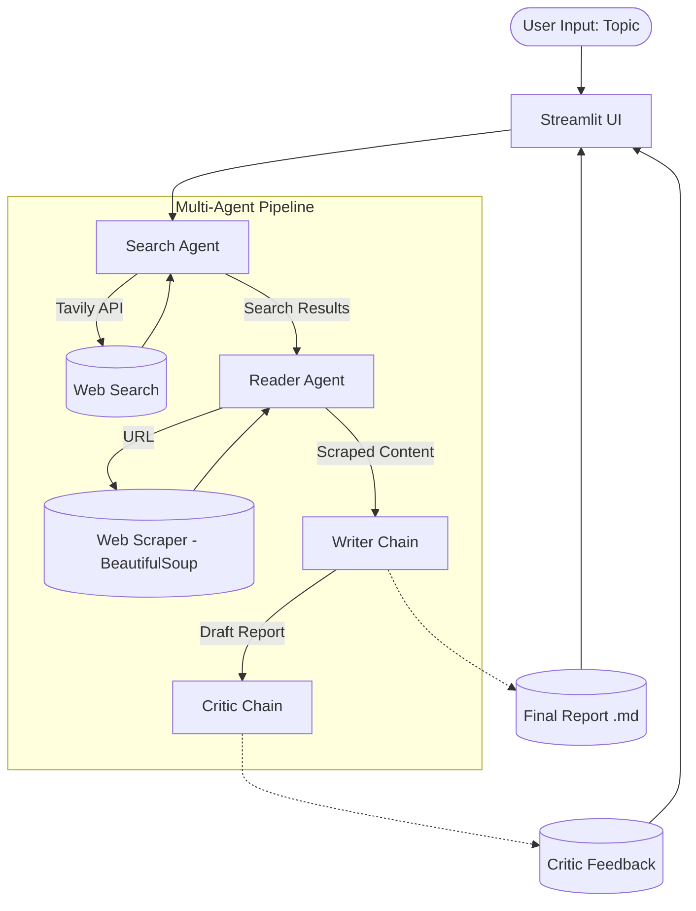
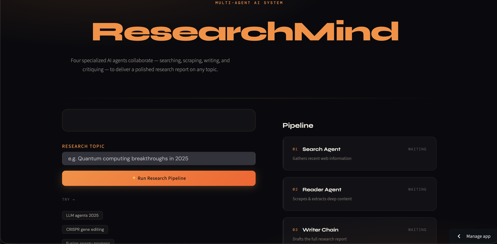
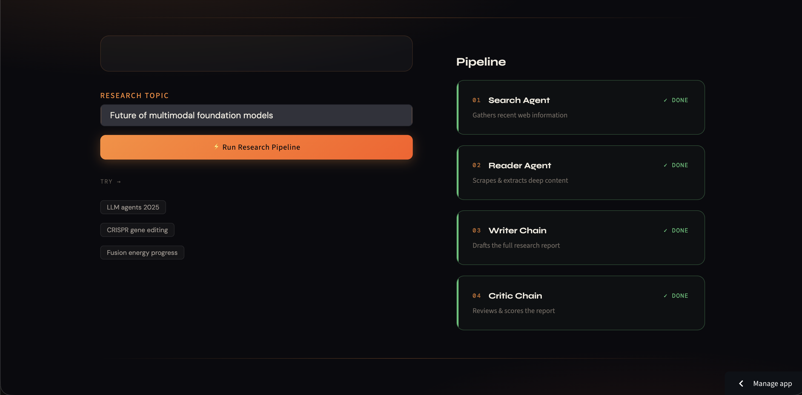
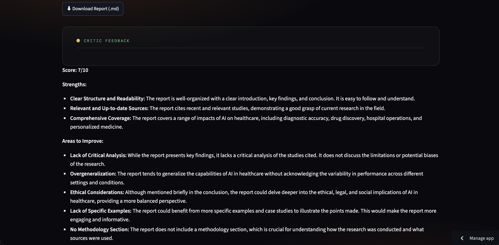

<div align="center">

# 🧠 ResearchMind

**An Intelligent Multi-Agent System for Comprehensive Automated Research**

[](https://python.org)
[](https://streamlit.io/)
[](https://langchain.com/)
[](https://mistral.ai/)
[](https://opensource.org/licenses/MIT)

</div>

---

## 📖 Overview

**ResearchMind** is an advanced, automated research assistant powered by a multi-agent AI architecture. It takes a research topic from the user and systematically gathers, analyzes, and synthesizes information from the web to produce a comprehensive, structured research report.

### The Problem It Solves
Conducting deep research manually involves endless searching, reading through fragmented sources, and synthesizing facts into a cohesive report—a highly time-consuming process. ResearchMind automates this pipeline entirely.

### Why Multi-Agent Architecture?
By dividing the task among specialized agents (Search, Read, Write, and Critic), the system ensures higher accuracy, reduces hallucination, and delivers deeper insights. Each agent handles a single responsibility, passing structured data to the next agent in the pipeline.

---

## ✨ Features

- 🤖 **Multi-Agent Workflow**: Specialized agents working collaboratively to search, scrape, write, and review.
- 🔍 **Web Search**: Integration with Tavily Search to find the most recent and reliable information.
- 🕷️ **Web Scraping**: Deep content extraction from top resources using BeautifulSoup.
- 📝 **AI Report Generation**: High-quality, structured markdown reports generated by Mistral AI.
- 🧐 **Research Critique**: An independent critic agent reviews the drafted report and provides actionable feedback and scoring.
- 🖥️ **Streamlit UI**: A beautiful, responsive, and interactive frontend for tracking the pipeline's progress in real time.
- 💾 **Markdown Report Download**: One-click download of the final research report.

---

## 🏗️ Architecture



---

## 🔄 Workflow

The pipeline executes through a carefully orchestrated sequence of steps:

1. **User Input**: The user enters a research topic in the Streamlit web interface (or CLI).
2. **Search Agent**: Queries the Tavily API to gather a curated list of recent, relevant URLs and snippets based on the topic.
3. **Reader Agent**: Analyzes the search results, identifies the single most relevant URL, and deeply scrapes its text content.
4. **Writer Chain**: Synthesizes the initial search snippets and the deeply scraped content to draft a highly detailed, professional research report.
5. **Critic Chain**: Reviews the generated report, scores it out of 10, highlights strengths, and suggests areas for improvement.
6. **Delivery**: The final report and the critic's review are displayed in the UI, and the user can download the report as a Markdown file.

---

## 📂 Project Structure

```text
.
├── app.py             # Streamlit web application and UI layout
├── pipeline.py        # CLI entry point to run the research pipeline
├── agents.py          # AI agent definitions (Search, Reader, Writer, Critic)
├── tools.py           # Custom LangChain tools (Tavily search, Web scraper)
├── requirements.txt   # Project dependencies
├── LICENSE            # MIT License
└── README.md          # Project documentation
```

### Key Components

- `app.py`: Contains the entire Streamlit frontend, managing the visual pipeline progress and rendering the final output.
- `pipeline.py`: A pure-Python implementation of the pipeline for running the system via the command line.
- `agents.py`: Configures the `langchain-mistralai` model and defines the prompts and chains for each specialized agent.
- `tools.py`: Implements the `web_search` tool (Tavily API) and `scrape_url` tool (Requests + BeautifulSoup).

---

## 🛠️ Technology Stack

| Component | Technology / Library | Description |
| :--- | :--- | :--- |
| **Language** | Python | Core programming language |
| **Frontend** | Streamlit | Web framework for the interactive UI |
| **Orchestration** | LangChain | Framework for developing LLM applications |
| **LLM Provider** | Mistral AI | `mistral-small-2506` model for reasoning and generation |
| **Search Engine** | Tavily Search | Search API optimized for AI agents |
| **Web Scraping** | BeautifulSoup & Requests| HTML parsing and HTTP requests for deep content extraction |

---

## 🚀 Installation

Follow these steps to set up the project locally.

### 1. Clone the repository

```bash
git clone https://github.com/sumitjadhav1703/Multi_agent_research_system.git
cd Multi_agent_research_system
```

### 2. Create a virtual environment

```bash
python3 -m venv venv
source venv/bin/activate
```

### 3. Install dependencies

```bash
pip install -r requirements.txt
```

### 4. Configure environment variables

Create a `.env` file in the root directory:

```bash
touch .env
```

Add your API keys to the `.env` file (see the [Environment Variables](#-environment-variables) section below).

---

## 🔐 Environment Variables

The system requires specific API keys to function. Add the following to your `.env` file:

```env
# Required for the LLM reasoning, writing, and critiquing (Agents & Chains)
MISTRAL_API_KEY=your_mistral_api_key_here

# Required for the Search Agent to query the web
TAVILY_API_KEY=your_tavily_api_key_here
```

*Note: You can get a Mistral API key from [console.mistral.ai](https://console.mistral.ai/) and a Tavily API key from [tavily.com](https://tavily.com/).*

---

## 💻 Usage

You can run ResearchMind either via the interactive Web UI or through the Command Line.

### Running the Web UI (Recommended)

Launch the Streamlit application:

```bash
streamlit run app.py
```

1. Open the provided Local URL in your browser (usually `http://localhost:8501`).
2. Enter your research topic in the input field.
3. Click **"⚡ Run Research Pipeline"**.
4. Watch the agents progress through the steps in real-time.
5. Read the final report and critic feedback directly in the app.
6. Click **"⬇ Download Report (.md)"** to save the results.

### Running via CLI

If you prefer a terminal interface, run the pipeline script directly:

```bash
python pipeline.py
```

When prompted, enter your research topic, and the agents will output their progress and final results directly to your terminal.

---

## 📸 Screenshots


*Initial view of the ResearchMind application.*


*Research pipeline in progress.*


*The generated report and critic feedback.*


---

## 🔮 Future Improvements

Based on the current architecture, potential enhancements include:

- **Parallel Web Scraping**: Upgrading the Reader Agent to scrape multiple URLs concurrently instead of just the top result.
- **Persistent Storage**: Adding a database (e.g., SQLite or Postgres) to save past research reports and user query history.
- **PDF Export**: Implementing a feature to download reports in PDF format in addition to Markdown.
- **Agent Memory**: Incorporating memory into the agents to allow users to ask follow-up questions about the generated report.
- **Citation Linking**: Automatically hyperlinking citations directly to the scraped sources within the report body.

---

## 🤝 Contributing

Contributions to ResearchMind are welcome! To contribute:

1. Fork the repository.
2. Create a new branch (`git checkout -b feature/AmazingFeature`).
3. Make your changes and commit them (`git commit -m 'Add some AmazingFeature'`).
4. Push to the branch (`git push origin feature/AmazingFeature`).
5. Open a Pull Request.

Please ensure your code adheres to standard Python styling (PEP 8) and that all required environment variables are documented if you introduce new dependencies.

---

## 📄 License

This project is licensed under the MIT License - see the [LICENSE](LICENSE) file for details.
